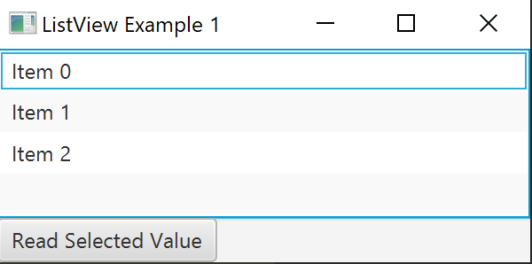

= ListView
Moritz Eder
2022-02-28
ifndef::imagesdir[:imagesdir: images]
//:toc-placement!:  // prevents the generation of the doc at this position, so it can be printed afterwards
:sourcedir: ../src/main/java
:icons: font
:sectnums:    // Nummerierung der Überschriften / section numbering
:toc: left

//Need this blank line after ifdef, don't know why...
ifdef::backend-html5[]

// print the toc here (not at the default position)
//toc::[]

== Was ist eine ListView?

Die ListView macht es möglich, dass ein User eine oder mehrere Optionen aus einer vordefinierten Liste auswählen kann.

=== Header 2

